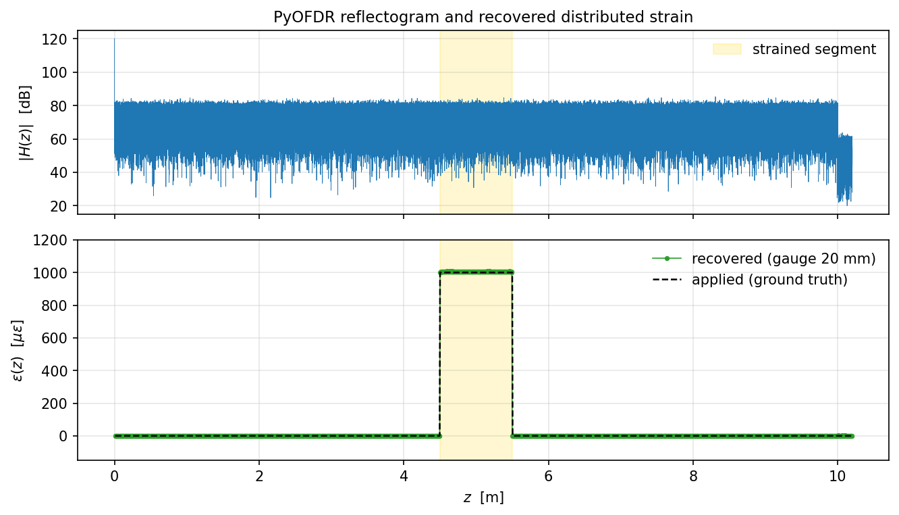

# PyOFDR


OFDR simulator in Python. Generates synthetic interrogator traces, from the swept laser to the digitized beat signal, so you can develop algorithms, train ML models, or size experiments without an instrument on the bench.



*1000 microstrain applied to a 1 m segment of a 10 m fiber, recovered from a single PyOFDR run by sub-spectrum cross-correlation against an unstrained baseline.*

## Why
Optical Frequency Domain Reflectometry is an extremely powerful tool for distributed fiber sensing, but commercial interrogators are often black boxes.
PyOFDR allowes you to:
- validate demodulation / strain-extraction algorithms against ground truth
- generate labelled OFDR training data at any chosen SNR
- size sweep range, sample rate, fiber length, expected noise floor before buying hardware

## Signal chain
```
Swept laser  -->  Main MZ + aux MZI  -->  Fiber (Rayleigh + features)  -->  Photodetector  -->  ADC
```

## What's simulated
| Stage | Modelled |
|---|---|
| **Source** | linear sweep + nonlinearity + ripple, phase noise (Wiener + flicker + RW), RIN, coherence roll-off |
| **Interferometer** | main Mach-Zehnder, auxiliary MZI for k-clock resampling, optical circulator, weak FBG arrays |
| **Fiber** | Rayleigh backscatter, attenuation, macrobend loss, discrete reflectors, chromatic dispersion (GVD), stochastic n(z), multiple-scattering ghosts, MCF core-to-core crosstalk |
| **Perturbations** | static + dynamic strain (harmonic, impulsive, thermal relaxation, random vibration), Cox shear-lag coating coupling, distributed temperature with strain-T cross-sensitivity |
| **Detection** | balanced photodetector, shot / thermal / dark-current noise, polynomial PD nonlinearity, anti-alias + Butterworth LPF |
| **ADC** | clip, quantize, jitter, DNL/INL, ENOB |
| **Output** | HDF5 streaming, multi-sweep campaigns |

Theory and references are in `docs/theory.md`

## Install
```bash
git clone https://github.com/ameoli/PyOFDR.git
cd PyOFDR
pip install -e .              # runtime
pip install -e .[dev]         # + pytest, matplotlib, jupyter
```

## Quick start
```python
from pyofdr.core.config import load_config
from pyofdr.core.campaign import run_campaign

cfg  = load_config("configs/ofdr_basic.yaml")
acqs = run_campaign(cfg)        # one Acquisition per sweep
acq  = acqs[-1]
# acq.digital_main : int16 array, shape (n_cores, n_samples)
```

The `pyofdr` CLI is installed as well:

```bash
pyofdr info     configs/ofdr_basic.yaml
pyofdr validate configs/ofdr_basic.yaml
pyofdr run -o out.h5 configs/ofdr_basic.yaml
```

## Tests
```bash
pytest tests/ -v
```


## Examples
`examples/` holds runnable Jupyter notebooks, one per topic.
Open them with `jupyter lab examples/`.

## Status
TBD

## Citing
If you use PyOFDR in published work, please cite it.

```bibtex
@software{pyofdr,
  author = {Meoli, Alessandro},
  title  = {PyOFDR: an end-to-end Python simulator for Optical Frequency Domain Reflectometry},
  year   = {2026},
  url    = {https://github.com/ameoli/PyOFDR},
}
```

## References
- Froggatt and Moore, *High-spatial-resolution distributed strain measurement in optical fiber with Rayleigh scatter*, Appl Opt 1998.
- Soller et al., *High resolution OFDR for characterization of components and assemblies*, Opt Express 2005.
- Hartog, *An Introduction to Distributed Optical Fibre Sensors*, CRC 2017.

## License
MIT -- see `LICENSE`.

### Third-party
[`felixpatzelt/colorednoise`](https://github.com/felixpatzelt/colorednoise) (MIT), vendored at `src/pyofdr/utils/colorednoise.py` for laser phase-noise PSD shaping. Full text in `LICENSES/colorednoise-MIT.txt`.

## Issues and contributions
Bugs and feature requests: https://github.com/ameoli/PyOFDR/issues
Pull requests welcome.